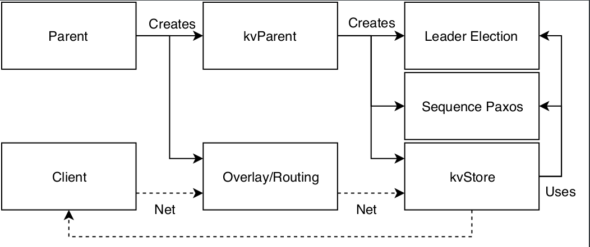

# Distributed and Linearizable Key Value Store with Leader Based Sequence Paxos

A distributed Key-Value (KV) store was implemented as the final course project. The KV store is linearizable for consistency, replicated for reliability and partitioned for efficient use of the allocated space.  It supports operations three operations: read, write, and compare-and-swap.

## Properties of the System


- **Partially Synchronous System**
    It is assumed that the system will eventually have some reasonable bounds on execution step time, message delays and clock drift to be able to make progress in the algorithms.
- **Fail Noisy**
    Given that timing assumption is a partially synchronous system, the assumed model for failures is fail noisy. Nodes may be faulty and fail but not recover again. These failures can eventually be detected using a eventually perfect failure detector.
- **FIFO Perfect Links**
    The behaviour of sending messages between components in the Kompics framework is approximately the same as the behaviour of a FIFO perfect links. This falls a bit short of the actual thing as they do not provide this behaviour in case of a session dropping. The implementation in this case does not allow nodes to resume their execution if they crash, while a dropped session might be reestablished. This is in violation with the liveness property, but assumed to be a minor problem for the purpose of showing the concepts of the data base.
- **Majority of Correct Processes**
    All the underlying components used assume that at least a majority of the processes are correct. In case that is not true, at least safety properties should be provided.

## Properties of the KV Store
The properties of the implementation can be inherited from the paxos algorithm, with added replicated state machine behaviour. 

- **Validity** 
    If process P processes operation  O  then  O  is in the sequence  C  of proposed commands without duplicates.
- **Integrity** 
    If process  P  decides to process  O  and later decides to process  O'  then  O'  will affect the state  S  of  P  after  O 
- **Termination** 
    If an operation  O  is proposed infinitely often by a process  P , then eventually every correct process performs the actions in a sequence containing  O 
- **Uniform Agreement** 
    If process  P  decides on processing  O  and process  Q  decides on processing  O' , they will both process  O  and  O'  in some common order.

## Architecture



## Running the Code

Make sure you have [sbt](https://www.scala-sbt.org/) installed.

### Building

Start sbt with

```bash
sbt
```

In the sbt REPL build the project with

```bash
compile
```

You can run the test suite (which includes simulations) with

```bash
test
```

Before running the project you need to create assembly files for the server and client:

```bash
server/assembly
client/assembly
```

### Running

#### Bootstrap Server Node

To run a bootstrap server node execute:

```
java -jar server/target/scala-2.12/server.jar -p 45678
```

This will start the bootstrap server on localhost:45678.

#### Extra Server Node

After you started a bootstrap server on `<bsip>:<bsport>`, again from the `server` directory execute:

```
java -jar server/target/scala-2.12/server.jar -p 45679 -s <bsip>:<bsport>
```

This will start the bootstrap server on localhost:45679, and ask it to connect to the bootstrap server at `<bsip>:<bsport>`.
Make sure you start every node on a different port if they are all running directly on the local machine. 

The Bootstrap server will initiate the cluster when at least 2 extra servers are connected with the default configuration.

#### Clients

To start a client (after the cluster is properly running) execute:

```
java -jar client/target/scala-2.12/client.jar -p 56787 -s <bsip>:<bsport>
```

Again, make sure not to double allocate ports on the same machine.

The client will attempt to contact the bootstrap server and give you a small command promt if successful. Type `help` to see the available commands.

## Final Words

The system is a linearizable KV-store, with replication and partitioning of data. It does not guarantee availability, but does guarantee consistency and partition tolerance. It is a CP data store according to the CAP theorem. Additionally it guarantees at least once delivery of any successful operation.

There are however severe limitations in using this KV-store in how it handles failures of nodes. When a node crashes it can never rejoin the system. When the system is booted, no new nodes can join at all. It has a very static structure. It would be better if the system could be reconfigured in run time, and this feature would not require a large rewrite of the code.

To solve this problem, stop sign commands which proposed new configurations should be appended to the current code base and allow an operator to select a new configuration before the current looses too many nodes to be able to decide things using consensus. This could also be automated to increase the chances of saving the system before it grinds to a halt. 

## Credit

The base for this project was written by Lars Kroll (<lkroll@kth.se>). It was extended to provide linearizable KV store behaviour while routing and start-up behavior was kept very similar to the original code base provided by Kroll.


